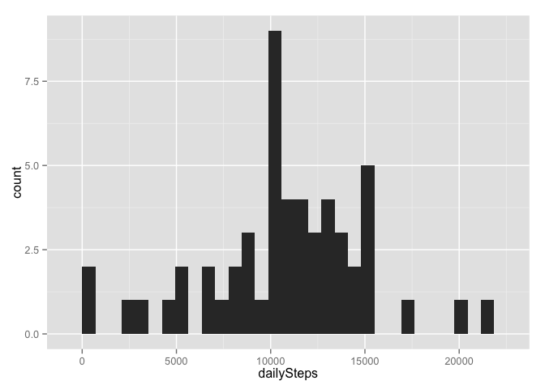
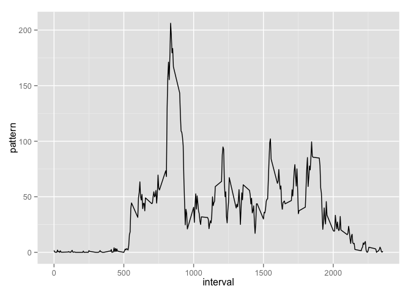
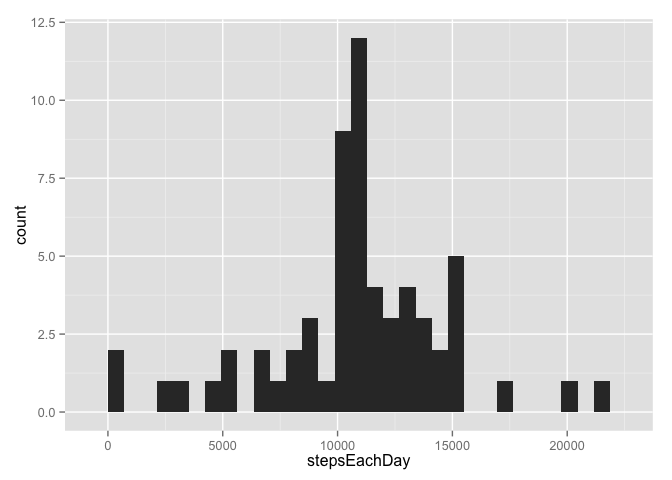
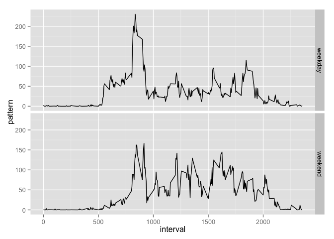

# Reproducible Research: Peer Assessment 1


## Loading and preprocessing the data

Loading the data:

```r
activity <- read.csv(file="~/Desktop/Coursera/Reproducible Research/Week 2/activity.csv")
```
No preprocessing at this stage, but some will be needed later to generate plots with ggplot2.

## What is mean total number of steps taken per day?

The dataset contains missing values, but these will be ignored for now.  The total number of steps taken each day is calculated and displayed in a histogram.


```r
library(ggplot2)

dailySteps <- tapply(activity$steps,activity$date,sum)

qplot(dailySteps, geom="histogram") 
```

 

The mean and median number of daily steps are

```r
mean(dailySteps,na.rm = TRUE)
```

```
## [1] 10766.19
```

```r
median(dailySteps,na.rm = TRUE)
```

```
## [1] 10765
```


## What is the average daily activity pattern?

The average number of steps taken, averaged across all days, as a function of the 5 minute interval is shown the plot below.

```r
dailyPattern <- tapply(activity$steps,activity$interval,mean,na.rm=TRUE)
dailyPatternDF<-data.frame(interval=as.numeric(names(dailyPattern)),pattern=dailyPattern)
ggplot(dailyPatternDF,aes(x=interval, y=pattern)) + geom_line()
```

 

The 5-minute interval that, on average across all the days in the dataset, contains the maximum number of steps is 835:

```r
dailyPattern[dailyPattern==max(dailyPattern)]
```

```
##      835 
## 206.1698
```

## Imputing missing values

The total number of missing values in the dataset is

```r
sum(is.na(activity))
```

```
## [1] 2304
```

A new dataset that is equal to the original dataset but with the missing data filled in is created.  We use the mean for that 5-minute interval to fill in all the missing values in the dataset.

```r
activityFilledIn <- activity
activityFilledIn[is.na(activityFilledIn),"steps"]<-dailyPattern[as.character(activity[is.na(activity),"interval"])]
```

The following histogram represents the total number of steps taken each day.

```r
stepsEachDay <- tapply(activityFilledIn$steps,activityFilledIn$date,sum)
qplot(stepsEachDay,geom="histogram")
```

 

The mean and median total number of steps taken per day are 

```r
mean(stepsEachDay)
```

```
## [1] 10766.19
```

```r
median(stepsEachDay)
```

```
## [1] 10766.19
```
The mean is the same as before.  The median increased by a relatively small amount.

## Are there differences in activity patterns between weekdays and weekends?

We introduce a new factor variable in the dataset with two levels -- "weekday" and "weekend" indicating whether a given date is a weekday or weekend day.

```r
MondayToFriday <- c('Monday', 'Tuesday', 'Wednesday', 'Thursday', 'Friday')
activityFilledIn$wd <- factor((weekdays(as.Date(activityFilledIn$date)) %in% MondayToFriday), levels=c(FALSE, TRUE), labels=c('weekend', 'weekday'))
```

The following panel plot contains a time series plot of the 5-minute interval (x-axis) and the average number of steps taken, averaged across all weekday days or weekend days (y-axis). 

```r
activityFilledInWeekday<-subset(activityFilledIn,wd=='weekday')
activityFilledInWeekend<-subset(activityFilledIn,wd=='weekend')
dailyPatternWeekday<-tapply(activityFilledInWeekday$steps,activityFilledInWeekday$interval,mean)
dailyPatternWeekend<-tapply(activityFilledInWeekend$steps,activityFilledInWeekend$interval,mean)

dailyPatternDF<-data.frame(interval=rep(as.numeric(names(dailyPattern)),2),pattern=c(dailyPatternWeekday,dailyPatternWeekend),wd=c(rep('weekday',length(dailyPatternWeekday)),rep('weekend',length(dailyPatternWeekend))))
ggplot(data=dailyPatternDF,aes(x=interval,y=pattern)) +geom_line()+facet_grid(wd ~ .)
```

 
